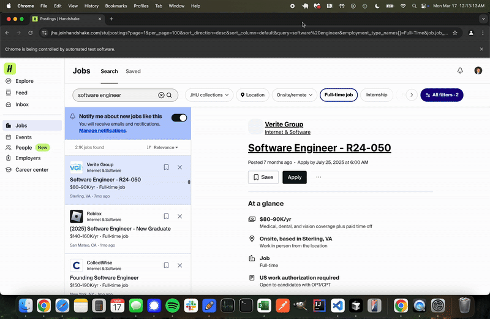

### To run the bot yourself
- create a .env file with the following fields:
  - EMAIL: outlook email
  - PASSWORD: outlook password
- Run apply.py. Make sure the IDE you're running from has permissions to use the mouse. If it doensn't, you should be prompted to allow it in settings once you run apply.py.

